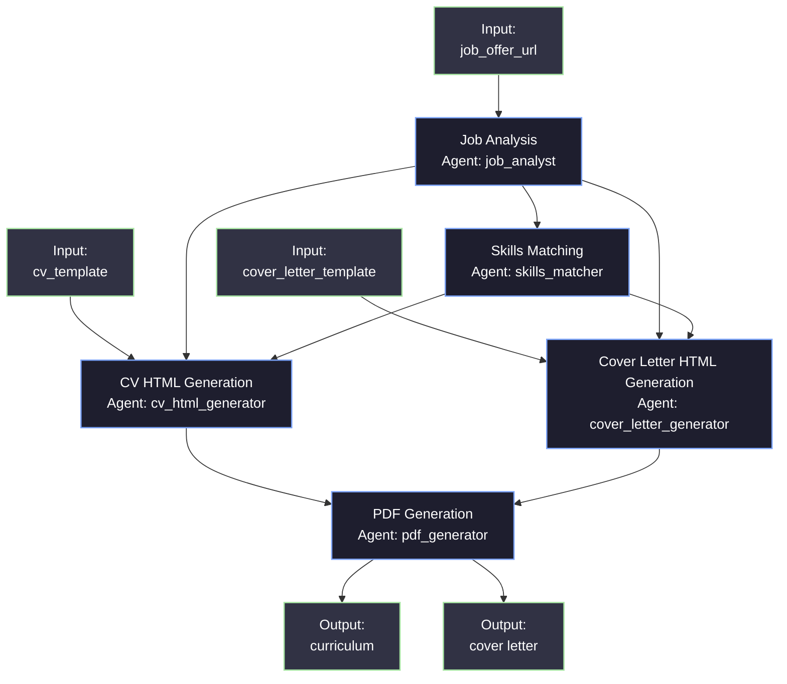
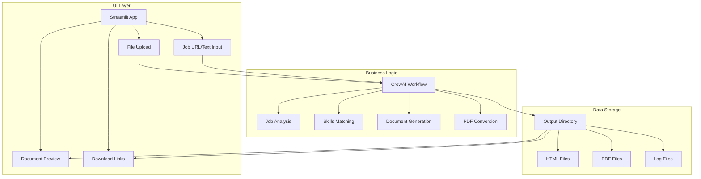

# CV & Cover Letter Generator with CrewAI

This project uses CrewAI to automatically tailor CVs and cover letters for specific job applications. It analyzes job postings, matches skills to requirements, generates customized HTML CVs and cover letters, and converts them to PDF format for submission.

## Key Features

- **Job Analysis**: Extracts critical requirements from job postings
- **Skills Matching**: Maps candidate skills to job requirements
- **HTML CV Generation**: Creates a professionally formatted CV in HTML
- **Cover Letter Generation**: Creates a tailored cover letter based on job requirements
- **PDF Conversion**: Converts HTML documents to PDF format for submission
- **Interactive UI**: Streamlit-based web interface for easy document generation

## System Architecture




## Workflow Process

1. **Input Collection**:
   - User provides a job posting URL or uses the default job offer text
   - System loads CV and cover letter HTML templates

2. **Job Analysis**:
   - The Job Analyst agent scrapes the job posting URL using the JobPostingScraper tool
   - If URL scraping fails, it falls back to the provided job offer text
   - Analyzes the job description to extract key requirements, skills, and company information

3. **Skills Matching**:
   - The Skills Matcher agent compares job requirements with candidate's skills
   - Prioritizes skills based on relevance to the job posting
   - Identifies which projects and experiences to highlight

4. **Document Generation**:
   - The CV HTML Generator creates a tailored HTML CV using the template and matched skills
   - The Cover Letter Generator creates a personalized cover letter addressing job requirements
   - Both documents are saved as HTML files

5. **PDF Conversion**:
   - The PDF Generator converts both HTML documents to PDF format using the ConverterHtmlToPdf tool
   - Final PDF files are saved to the output directory

This workflow ensures that both the CV and cover letter are strategically customized for each job application, highlighting the most relevant skills and experiences to maximize the candidate's chances of success.

## Installation

Ensure you have Python >=3.10 <=3.13 installed on your system. This project uses [Poetry](https://python-poetry.org/) for dependency management and package handling, offering a seamless setup and execution experience.

First, if you haven't already, install Poetry:

```bash
pip install poetry
```

Next, navigate to your project directory and install the dependencies:

1. First lock the dependencies and then install them:
```bash
poetry lock
```
```bash
poetry install
```

### Alternatively, you can use pip:

```bash
pip install -r requirements.txt
```

## Configuration

**Set your API keys in the `.env` file**

```
OPENAI_API_KEY=your_openai_key_here
ANTHROPIC_API_KEY=your_anthropic_key_here  # Optional
```

## Usage

### Command Line Interface

1. Start the CV generation process:

```bash
poetry run cv_gen
```

2. Enter a job posting URL when prompted, or press Enter to use the default job offer
3. The system will:
   - Analyze the job posting
   - Match your skills to the job requirements
   - Generate a tailored HTML CV
   - Create a personalized cover letter
   - Convert both documents to PDF format
4. Find your customized documents in the `output` directory:
   - `cv_YYYY-MM-DD.html` - HTML version of your CV
   - `cv_YYYY-MM-DD.pdf` - PDF version of your CV
   - `cover_letter_YYYY-MM-DD.html` - HTML version of your cover letter
   - `cover_letter_YYYY-MM-DD.pdf` - PDF version of your cover letter

### Interactive UI Dashboard (Streamlit)

For a more user-friendly experience, you can use the Streamlit web interface:

```bash
# Option 1: Use the provided script
./run_ui.sh

# Option 2: Run directly with Python path
cd /home/blarger/Desktop/projects/AI-Agents/finvest-news-ai
PYTHONPATH=$PYTHONPATH:$(pwd) streamlit run src/gui/app.py
```

This will launch a web interface in your browser with the following features:

1. **Upload CV (Optional)**: Upload your existing CV in PDF or DOCX format
2. **Job Description Input**:
   - Paste job description text directly
   - Upload a job description file (PDF, DOCX, TXT)
   - Provide a URL to a job posting
3. **Generate Documents**: Click the "Generate CV & Cover Letter" button
4. **Preview and Download**: View and download your generated documents


#### How the UI Works

The Streamlit interface provides an intuitive workflow:

1. The sidebar explains the process and what to expect
2. The main area has sections for uploading your CV and entering job details
3. After generation, you can preview both documents directly in the browser
4. Download links appear for all generated files (HTML and PDF versions)

### Getting Started with the UI

To make the most of the interactive UI:

1. **Prepare Your Materials**:
   - Have your existing CV ready in PDF or DOCX format (optional)
   - Find a job posting you're interested in (URL or text)
   
2. **Launch the Application**:
   ```bash
   cd /home/blarger/Desktop/projects/AI-Agents/finvest-news-ai
   streamlit run src/gui/app.py
   ```
   
3. **Input Methods**:
   - **URL Method**: Paste a job posting URL and the system will automatically scrape and analyze the content
   - **Text Method**: Copy and paste the job description text directly into the interface
   - **File Method**: Upload a saved job description file (useful if you've saved postings offline)
   
4. **Generation Process**:
   - The UI will show real-time updates as the system:
     - Analyzes the job requirements
     - Matches them with your skills
     - Generates customized documents
     - Converts them to PDF format
   
5. **Review and Download**:
   - Preview both documents directly in your browser
   - Check that your skills are properly highlighted
   - Download HTML and PDF versions for your application

The UI makes the process more accessible by providing a visual interface and eliminating the need to interact with the command line.

## Customizing

- Modify `src/cv_gen/config/agents.yaml` to define your agents and their roles
- Modify `src/cv_gen/config/tasks.yaml` to define your tasks and workflow
- Modify `src/cv_gen/config/cv_template.html` to change the CV template
- Modify `src/cv_gen/config/cover_letter_template.html` to change the cover letter template
- Modify `src/cv_gen/crew.py` to add your own logic and tools
- Update `src/cv_gen/tools/tools.py` to add new functionality to the system
- Customize `src/gui/app.py` to change the Streamlit UI

## UI Architecture

The Streamlit UI interfaces with the CrewAI backend in the following way:



The UI layer collects user inputs and passes them to the CrewAI workflow, which then processes the data through its agents and tasks. The generated files are saved to the output directory, which the UI then reads to provide previews and download links.

## Extending the UI

The Streamlit UI can be extended with additional features:

1. **Candidate Profile Management**:
   - Add a section to input and save personal information
   - Create and switch between multiple profiles
   - Store education and work history

2. **Template Gallery**:
   - Add multiple CV and cover letter templates
   - Provide a visual preview of each template
   - Allow users to customize colors and fonts

3. **Application Tracking**:
   - Add a database to store job applications
   - Track status (applied, interview, offer, etc.)
   - Set reminders for follow-ups

4. **Skills Analysis**:
   - Visualize skill matches with interactive charts
   - Suggest skill improvements based on job market trends
   - Compare skills across multiple job postings

To implement these extensions, modify the `src/gui/app.py` file and add new components as needed.

## Converting HTML to PDF

The system uses Playwright to convert HTML CVs to PDF format. Make sure Playwright is properly installed:

```bash
playwright install chromium
```

## Running the Project

To kickstart your crew of AI agents and begin task execution, run this from the root folder of your project:

```bash
poetry run cv_gen
```

This command initializes the CV generator Crew, assembling the agents and assigning them tasks as defined in your configuration.

The output will include both a customized CV and cover letter tailored to the specific job posting, saved in the `output` directory.

## Understanding Your Crew

The CV Generator Crew is composed of multiple AI agents, each with unique roles, goals, and tools:

1. **Job Analyst**: Analyzes job postings to extract key requirements and company information
2. **Skills Matcher**: Matches candidate skills to job requirements and prioritizes them
3. **CV HTML Generator**: Creates a tailored HTML CV using the template and matched skills
4. **Cover Letter Generator**: Creates a personalized cover letter addressing job requirements
5. **PDF Generator**: Converts HTML documents to PDF format

These agents collaborate through a series of sequential tasks, defined in `config/tasks.yaml`, leveraging their collective intelligence to create highly customized application documents. The `config/agents.yaml` file outlines the capabilities and backstory of each agent in your crew, defining their expertise and approach to their assigned tasks.

## Support

For support, questions, or feedback regarding the NewsletterGen Crew or crewAI.
- Visit our [documentation](https://docs.crewai.com)
- Reach out to us through our [GitHub repository](https://github.com/joaomdmoura/crewai)
- [Joing our Discord](https://discord.com/invite/X4JWnZnxPb)
- [Chat wtih our docs](https://chatg.pt/DWjSBZn)

Let's create wonders together with the power and simplicity of crewAI.